# FreeScout for Synology DSM

<p align="center"></p>

A DSM 7 package that installs [FreeScout](https://freescout.net) — the free
help desk and shared mailbox — in Container Manager, and adds a **FreeScout**
window to DSM for the things you otherwise need a shell for: locked-out
administrators, backups, mail health, a module store, updates, storage, the
activity log, and a clean removal.

**Install:** download the latest `.spk` from
[Releases](https://github.com/tombruton87/freescout-dsm/releases), then
Package Center → Manual Install. DSM 7.2.1 or later; Container Manager is
installed first if missing. The wizard asks for the NAS's address, a port, a
time zone and the first administrator. The first start pulls the images (a few
hundred MB) and sets the database up; then open **FreeScout** from DSM's main
menu.

## The window

| | |
|---|---|
| 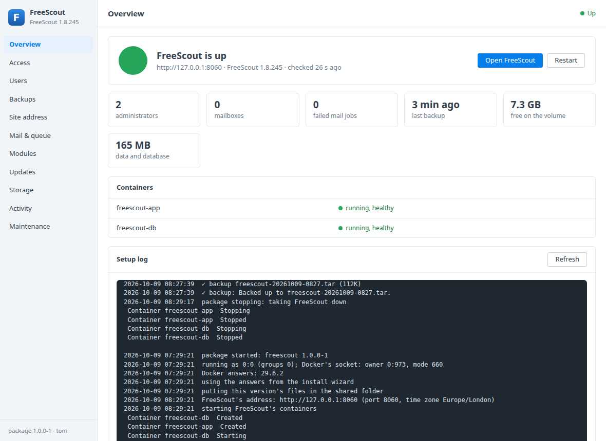 **Overview** — is it up, which containers, free space, last backup, the setup log. | 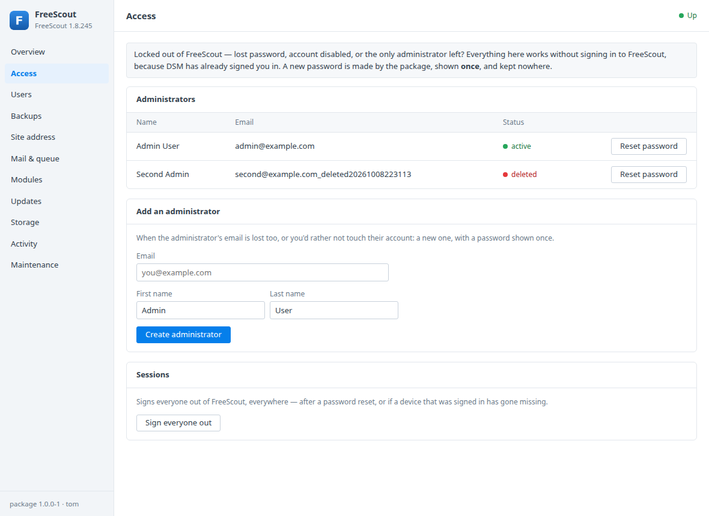 **Access** — a new password for a locked-out administrator, shown once; add an administrator; sign everyone out. |
| 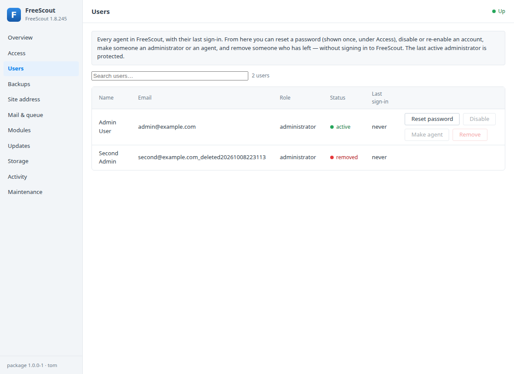 **Users** — every agent with role, status and last sign-in; reset, enable/disable, make administrator or agent, remove. | 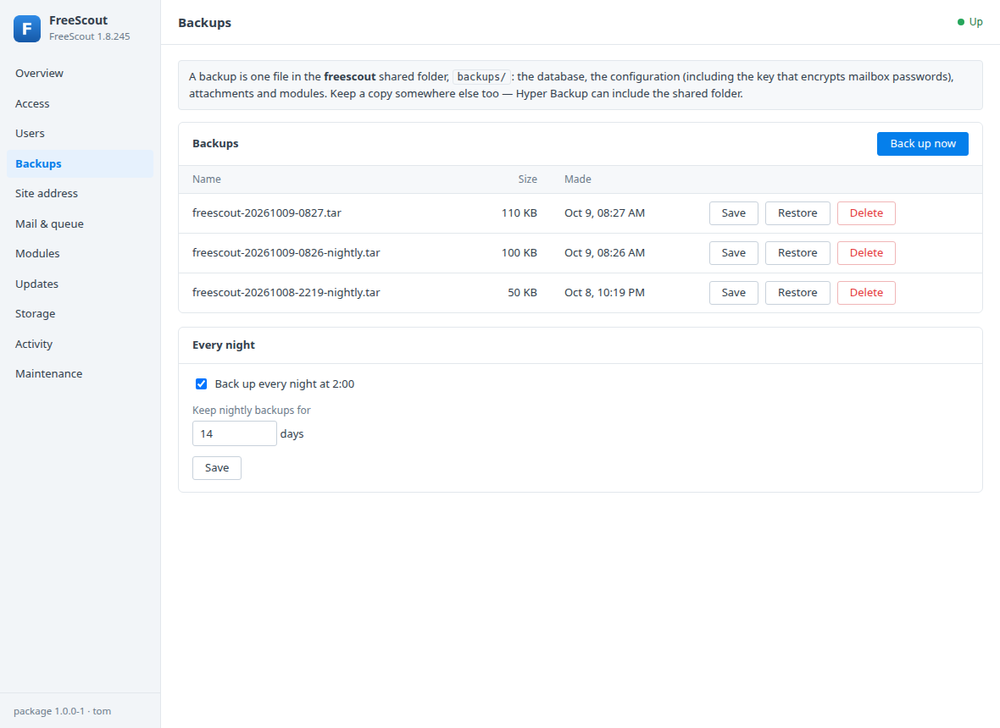 **Backups** — one tar per backup (database, config with the APP_KEY, attachments, modules); nightly, save, restore, retention. |
| 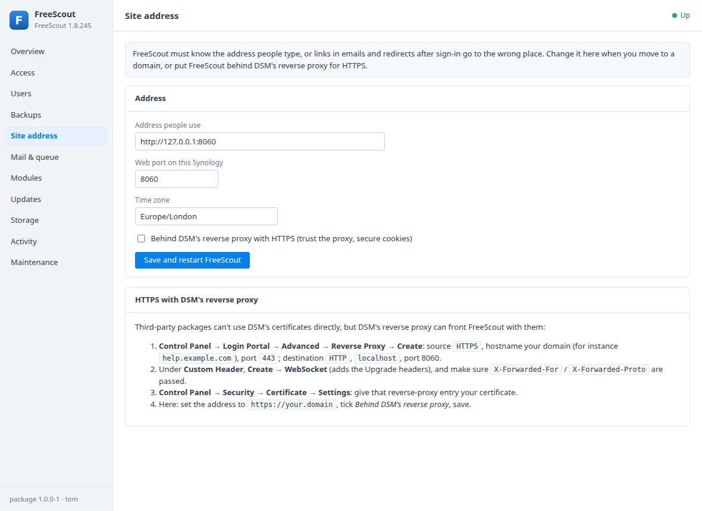 **Site address** — URL, port, time zone; HTTPS behind DSM's reverse proxy, steps included. | 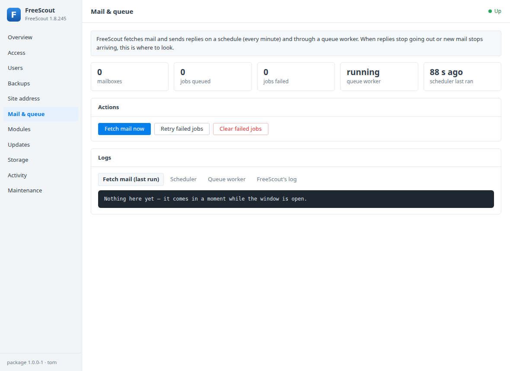 **Mail & queue** — mailboxes, failed jobs, worker and scheduler; fetch now, retry or clear; the logs. |
| 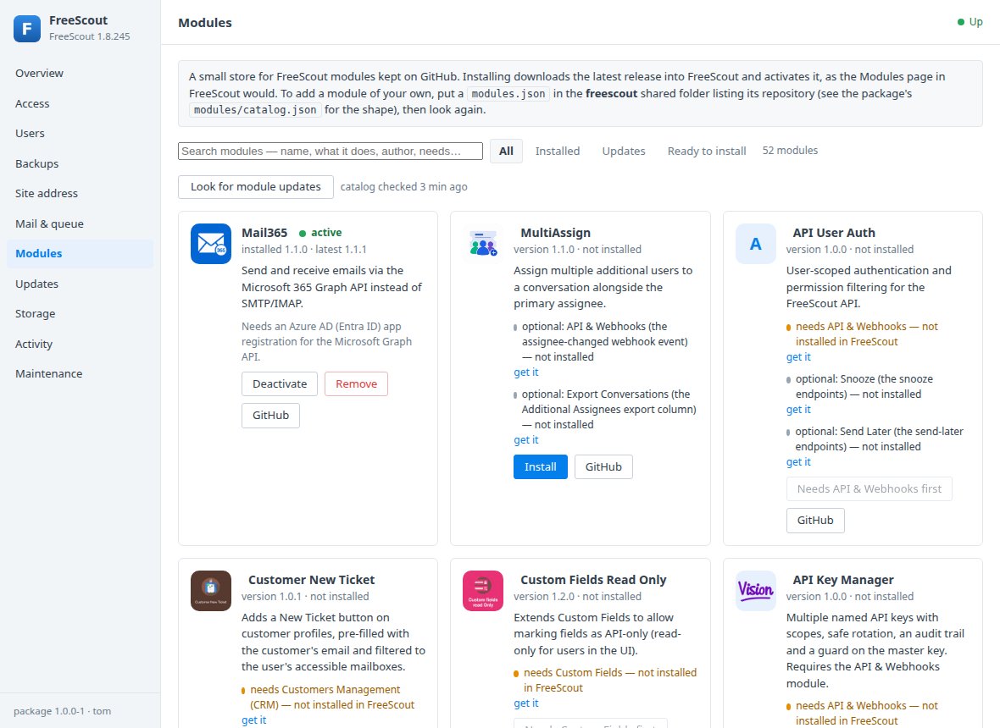 **Modules** — a store of 52 FreeScout modules from GitHub with what each needs; install, update, activate, remove; search and filters. | 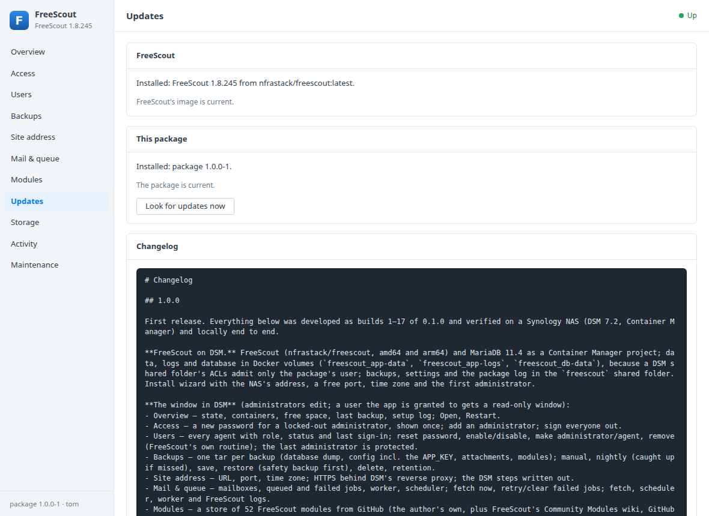 **Updates** — a newer FreeScout image or package, applied from inside DSM. |
| 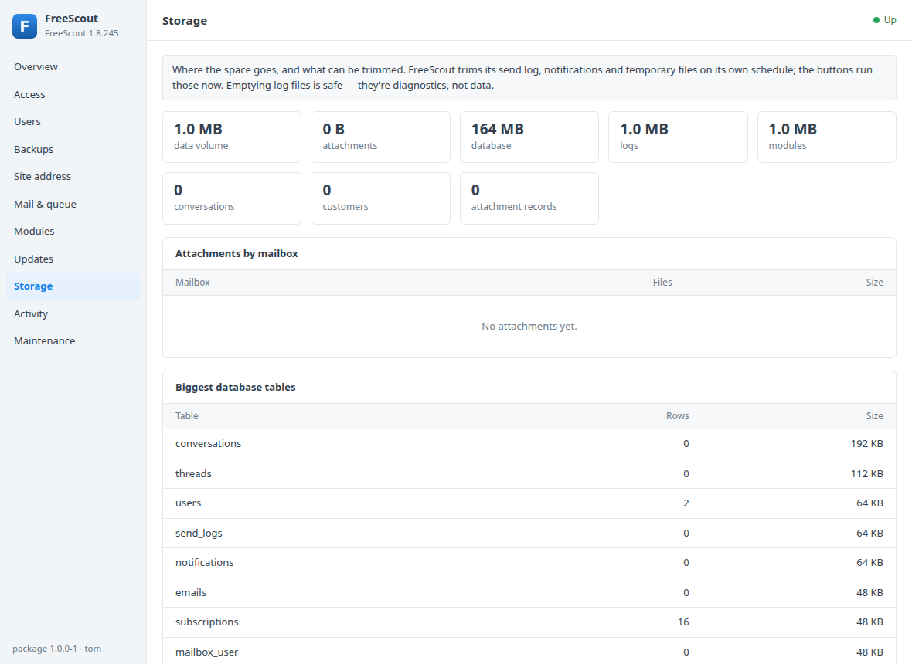 **Storage** — attachments per mailbox, biggest tables, folder sizes; trim and empty. | 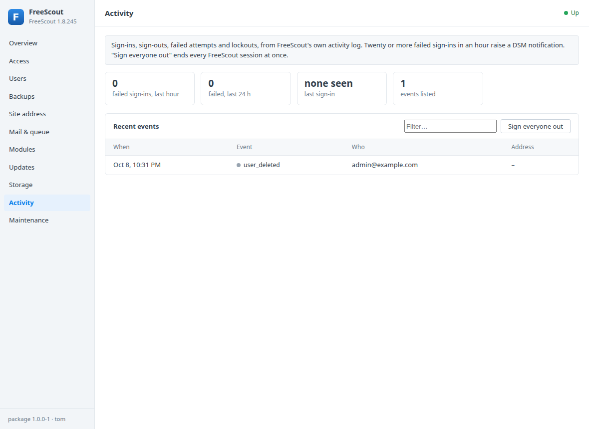 **Activity** — sign-ins, failed attempts and lockouts with addresses; a DSM notification on a burst. |
| 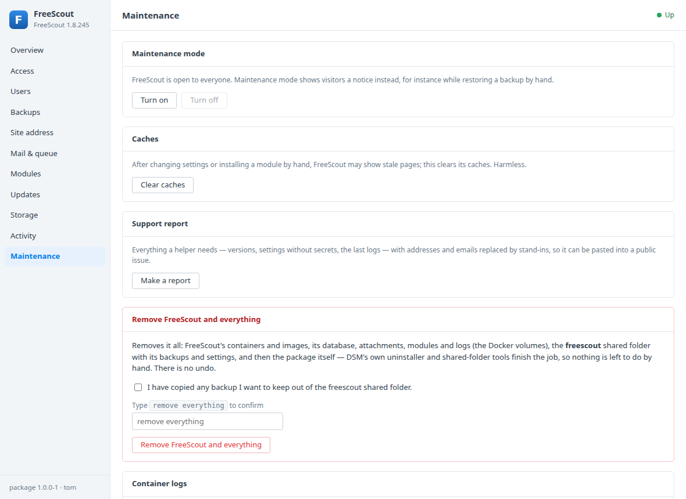 **Maintenance** — maintenance mode, caches, a redacted support report, container logs, and *Remove FreeScout and everything*. | |

## What's in the window

| Tab | What it does |
|---|---|
| **Overview** | Is it up, which containers, free space, last backup, the setup log; Open / Restart. |
| **Access** | Locked out? Pick an administrator and get a **new password**, shown once, made by the package (the account is made active again and its sessions dropped). Or **create a new administrator**. **Sign everyone out.** |
| **Backups** | **Back up now** (database dump + config incl. the APP_KEY + attachments + modules → one tar in the share), save, **restore** (a safety backup is taken first), delete. **Nightly at 02:00** with a retention in days. |
| **Site address** | Change the address people use, the port and time zone; one tick for **HTTPS behind DSM's reverse proxy** (trusted proxies, secure cookies), with the DSM steps written out. |
| **Mail & queue** | Mailboxes, queued and **failed jobs**, is the queue worker alive, when the scheduler last ran. **Fetch mail now**, **retry** or **clear failed jobs**, and the fetch / scheduler / worker / FreeScout logs. |
| **Modules** | A small store: modules from GitHub (`modules/catalog.json`, plus your own `modules.json` in the share), with logo, description, latest release and **what each needs** (official modules such as API & Webhooks, CRM or Custom Fields, with whether they're active here; a minimum FreeScout version). **Install**, **update**, activate, deactivate, remove — activation goes through FreeScout's own code, as its Modules page does. A module kept in a folder of its repository (`path`) or one that ships its own `composer.json` (`composer_install`) is handled. |
| **Updates** | A newer **FreeScout image** in the registry? Update it (backup first, pull, migrate). A newer **package** on GitHub? Install it from inside DSM. |
| **Storage** | Attachments per mailbox, biggest database tables, folder sizes; trim the send log, notifications and temporary files, empty log files. |
| **Activity** | Sign-ins, sign-outs, failed attempts and lockouts from FreeScout's activity log, failed attempts by address, sign everyone out; a DSM notification on a burst of failures. |
| **Maintenance** | Maintenance mode on/off, clear caches, a **redacted support report** to paste into an issue, container logs, and **Remove FreeScout and everything** (containers, images, volumes, the shared folder, then the package itself through DSM's own uninstaller). |

**Who may do what.** The app is shown to DSM administrators, who can do everything. An administrator can grant it to other users or groups (Control Panel → User & Group → Applications → FreeScout); they get a read-only window. Every change is checked server-side against DSM's own sign-in and the `administrators` group, whatever the page shows.

DSM notifications go to administrators when a container keeps stopping or a
nightly backup fails.

## How it's built

Package Center runs a third-party package as an unprivileged user, which
cannot use Docker. So the package is three things:

1. **`synology/scripts`, the wizard and `ui/api.cgi`** run as the package
   user. They write small files into the package's `var/` (the wizard's
   answers, a request from a button) and read JSON the setup container keeps
   fresh. They never run anything.
2. **The setup container** (`synology/setup/`), declared in `conf/resource`
   as a Container Manager project, runs as root with the Docker socket. It
   writes `.env`, runs `docker compose up`, watches, backs up, resets
   passwords, and reads every request **as data** — each line matched, each
   key allow-listed, each value re-checked.
3. **FreeScout's own compose project** (`app/compose.yaml`): the
   `nfrastack/freescout` image (amd64 and arm64) and MariaDB 11.4, with their
   data in Docker volumes, run from the `freescout` shared folder exactly as
   they would anywhere.

## Layout

```
VERSION                   the package's version (build.sh adds -N)
app/compose.yaml          FreeScout + MariaDB; copied into the share
app/env.example           what the setup container writes to .env
synology/INFO.in          package metadata
synology/conf/            privilege (run-as package), resource (share, firewall, setup project)
synology/scripts/         DSM lifecycle hooks: tiny, log and exit 0
synology/WIZARD_UIFILES/  the install wizard (generated: suggests this NAS's IP, a free port, its time zone)
synology/setup/           the setup container: Dockerfile, compose.yaml, run.sh
synology/target/ui/       the DSM window: config, freescout.js, panel.html, panel.js, api.cgi, texts/
synology/target/freescout.sc   firewall application entry
modules/catalog.json      the module store's list of GitHub repositories
synology/build.sh         → dist/freescout-<version>-<N>.spk
tests/                    api.cgi and run.sh validator tests, runnable on any Linux
```

## Build

```bash
synology/build.sh 1
```

Needs bash, tar, python3 with Pillow (icons), md5sum. Rebuilding the same
version for DSM means the next build number: `synology/build.sh 2`.

## Install

Package Center → Manual Install → the `.spk`. The wizard asks for the NAS's
address, a port, a time zone and the first administrator's email and
password. The first start pulls the images and sets the database up (a few
minutes); follow it under Package Center → FreeScout → View log, then open
**FreeScout** from DSM's main menu.

FreeScout's data, logs and database live in Docker volumes
(`freescout_app-data`, `freescout_app-logs`, `freescout_db-data`): a DSM shared
folder's ACLs admit only the package's user, and the containers' own users
(nginx, mysql) can't write there. The `freescout` shared folder holds what the
package writes itself: `backups/` (each one a full copy: database dump,
config with the APP_KEY, attachments, modules), `.env`, `compose.yaml`,
`package.log`. Everything stays when the package is removed. Point Hyper
Backup at the shared folder and the nightly backups cover the lot. To see it in File Station:
Control Panel → Shared Folder → freescout → Edit → Permissions.

## Test without a NAS

```bash
tests/run.sh
```

exercises `api.cgi` (sign-in, roles, every validation branch, the one-time
password hand-over) with a stub `authenticate.cgi`, `run.sh`'s
`read_settings` with good and hostile request files, and the wizard's JSON.

```bash
tests/e2e.sh          # up, act, down — or one of those
```

runs the real setup container on any Linux box with Docker: a scratch share
mounted at the same path inside and out (as on DSM), the wizard's answers as
`postinst` leaves them, a real FreeScout and MariaDB, then every window
action one by one (backup, password reset with an actual sign-in, new
administrator, restore, settings, mail, report, a hostile request) and a
SIGTERM stop. `tests/e2e.sh clean` removes the containers and the scratch
share. While it's up, `tests/devserver.py` serves the window page and runs
the real `api.cgi` against that run, for a browser on the same machine.

Container Manager's own behaviour (running containers as the package user,
refusing missing bind mounts, firewall `.sc`, notifications) can only be
tested on a real DSM — `run.sh`'s first log lines are written so one exported
log is enough to see what happened.

## Releasing

The package only ships compose files; FreeScout is the image. A release is
the `.spk` attached to a GitHub release of `tombruton87/freescout-dsm` (the
Update tab reads `releases/latest` and only installs an asset whose `INFO`
says `package="freescout"` with a newer version). Change `REPO` at the top of
`synology/setup/run.sh` if the repository moves.
